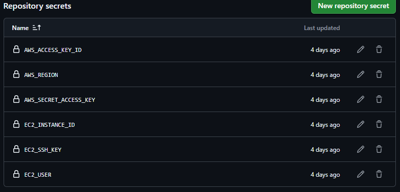
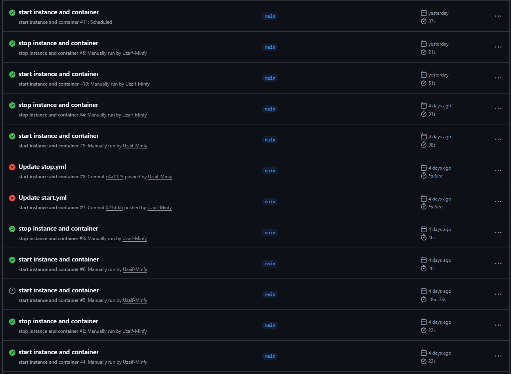

<pre>
npm create vite@latest meme-generator
cd meme-generator
 
npm install tailwindcss @tailwindcss/vite
npm install dotenv   
npm install firebase react-router-dom
npm install @reduxjs/toolkit react-redux
npm install react@18 react-dom@18 react-draggable
npm install dom-to-image-more
 
/*to run-->*/ npm run dev
</pre>

---

#  Workflows

## 1. **Start EC2 & Deploy**

- Triggered automatically at **10:00 AM IST (Mon–Fri)**
- Or manually from GitHub Actions
- Starts EC2 instance, pulls latest images, and runs containers

## 2. **Stop EC2 & Clean Up**

- Triggered automatically at **11:00 AM IST (Mon–Fri)**
- Or manually from GitHub Actions
- Stops containers and EC2 instance

## **Repository Secrets**

## **Repository workflows**

